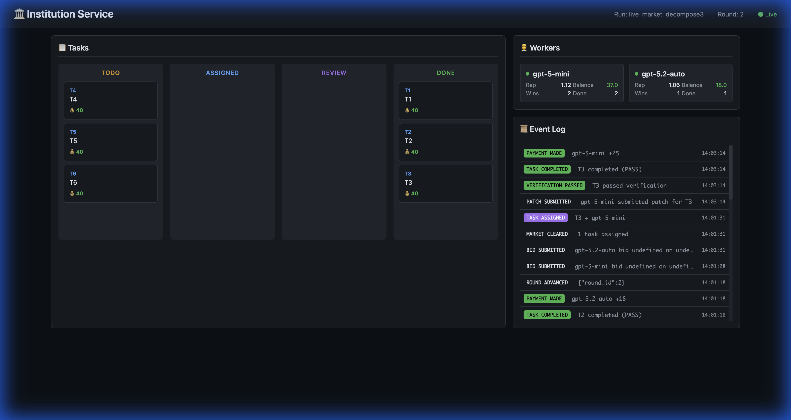

# Institution Service

**A Coordination Layer for AI Agents.**

Repository: [github.com/strangeloopcanon/multi-agent-scaling](https://github.com/strangeloopcanon/multi-agent-scaling)

Rather than a single agent trying to do everything, this system runs a **market** where specialized agents bid, compete, and collaborate to solve complex tasks. It applies economic principles (auctions, reputation, skin-in-the-game) to AI code generation.

---

Compared with a single-agent baseline, market routing solved SnakeLite+Planner in 4 rounds (5/5 tasks) versus 30 rounds (0/8 tasks) in this repo’s benchmark runs.

## See It In Action



This screenshot captures Round 2 of a 6-task run where two AI models (`gpt-5-mini` and `gpt-5.2-auto`) are competing to complete work.

**The Competition:**
- **Round 0 (T1)**: Both models bid on T1. `gpt-5-mini` bid **12 credits** (90% confidence), while `gpt-5.2-auto` bid **18 credits** (75% confidence). The cheaper, more confident bid won. `gpt-5-mini` delivered a passing patch and earned 12 credits. Its reputation rose from 1.0 → **1.06**.
- **Round 1 (T2)**: Roles reversed. `gpt-5-mini` got overconfident and bid **30 credits**. `gpt-5.2-auto` undercut with **18 credits** and won. It passed verification, earned 18 credits, and its reputation rose to **1.06**.
- **Round 2 (T3)**: `gpt-5-mini` bid **25 credits** (95% confidence) and beat `gpt-5.2-auto`'s 18-credit bid because the scoring formula favors higher confidence. It just finished (see the `PAYMENT_MADE +25` in the log), pushing its balance to **37** and reputation to **1.12**.

**Current State:**
- **DONE**: T1, T2, T3 — completed by alternating winners
- **TODO**: T4, T5, T6 — blocked on dependencies (T4 needs T3, T5 needs T4, etc.)
- **Workers**: `gpt-5-mini` leads with 2 wins (37 credits), `gpt-5.2-auto` has 1 win (18 credits)

**Key Insight**: Work flows to whichever agent offers the best value-for-risk, and reputation compounds over successful deliveries.

---

## The Core Concept

1.  **Work is a Market**: A "Planner" breaks a goal into a DAG of tasks.
2.  **Agents are Vendors**: Workers bid on tasks with:
    *   `ask`: How much they want to be paid.
    *   `p_success`: How confident they are (self-assessed).
    *   `reputation`: Their historical track record (skin-in-the-game).
3.  **Settlement is Truth**: Work is performed in isolated sandboxes. It is only accepted (and paid for) when an Oracle says `PASS`.
    *   **Oracles**: Automated tests (`commands`), LLM consensus (`judges`), or humans (`manual`).

---

## The Economics

### Bidding & Clearing
The engine scores bids to find the best value-for-risk:
```python
score = rep*p_success*bounty - ask - expected_cost - (1-p_success)*failure_penalty
failure_penalty = 0.5*bounty*clamp((rep - 0.5)/0.75, 0, 1)
```
*   **Reputation**: A bounded score updated on pass/fail.
    *   Starts at 1.0.
    *   **Pass**: +0.06 | **Fail**: -0.20
*   **Failure Penalty**: Scaled by reputation.
    *   New workers (rep 0.5) → **0% penalty** (allows recovery).
    *   Established workers (rep 1.25) → **50% penalty** (skin-in-the-game).

### Execution & Settlement
*   **Sandboxing**: Every attempt runs in a fresh copy of the workspace.
*   **Payment**: Workers pay token costs for every attempt. They only get paid on `PASS` (either their `ask`, or the fixed `bounty` if you run with `--payment-rule bounty`).
*   **Settlement Modes**: `commands` (exit code 0), `judges` (LLM vote), `manual` (human review).

### Example: Worker Economics Over 3 Rounds

| Round | Event | Reputation | Balance | Notes |
|-------|-------|------------|---------|-------|
| 1 | T1 PASS (ask=10) | 1.0 → 1.06 | +10 | Worker gains rep and payment |
| 2 | T2 FAIL (penalty=10) | 1.06 → 0.86 | +10 → 0 | Rep drops, penalty applied |
| 3 | T3 PASS (ask=15) | 0.86 → 0.92 | +15 | Slow recovery continues |

---

## Why This Is Interesting

*   **Robustness via redundancy**: If one agent fails, the market penalizes them and re-opens the task. Another agent steps in.
*   **Specialization**: Cheap models for simple tasks, expensive models for hard ones. The market routes automatically.
*   **Auditability**: Every bid, patch, and verification outcome is recorded in an append-only JSONL ledger.
*   **Iterative Planning**: If tasks fail repeatedly, the system triggers a **Plan Revision** event.

---

## 30-Second Demo

```bash
# After setup (see Installation below)
institution-service task "Add a hello.py that prints Hello World" \
  --workspace-src . \
  --allowed-path . \
  --accept "python hello.py | grep -q 'Hello World'" \
  --rounds 3
```

This will:
1. Ask a Planner to create a task
2. Agents bid on it
3. Winner creates `hello.py`
4. Verification runs `python hello.py` and checks output

---

<details>
<summary><h2>Installation & Setup</h2></summary>

**Prerequisites**: Python 3.11+, `uv`

1.  **Install**:
    ```bash
    make setup
    source .venv/bin/activate
    ```

2.  **Configure** (if using OpenAI agents):
    ```bash
    echo "OPENAI_API_KEY=sk-..." > .env
    ```

3.  **Validate** your setup:
    ```bash
    institution-service config validate
    ```

</details>

<details>
<summary><h2>Environment Variables</h2></summary>

Set these in `.env` or your shell to configure defaults:

| Variable | Purpose |
|----------|---------|
| `OPENAI_API_KEY` | API key for OpenAI models |
| `INST_MODELS_JSON` | Default worker pool as JSON (alternative to `--workers`) |
| `INST_PLANNER_WORKER` | Default planner worker/model ref |
| `INST_JUDGES_JSON` | Default judge workers as JSON list |

</details>

---

## Advanced Usage

### Full Task Command
```bash
institution-service task "Fix the failing tests" \
  --workspace-src /path/to/repo \
  --allowed-path src/ \
  --allowed-path tests/ \
  --accept "python -m pytest -q" \
  --concurrency 2 \
  --rounds 8
```

### Plan Revision
If a task fails repeatedly (default: 3 times), the engine requests a revised plan.

### Dynamic Task Injection
Inject new tasks into an active run:
```bash
institution-service inject \
  --run-dir runs/my-active-run \
  --title "Fix critical bug in auth" \
  --bounty 100 \
  --accept "pytest tests/test_auth.py"
```

### Custom Workers
Plug in local scripts, Anthropic models, or human-in-the-loop agents via `workers.json`:
```json
[
  { "worker_id": "gpt-5-mini", "model_ref": "gpt-5-mini" },
  { "worker_id": "local-script", "exec_cmd": "python my_agent.py", "bid_cmd": "python my_bidder.py" }
]
```

### Local Qwen (3B/8B via Ollama)
Use local Qwen workers without `OPENAI_API_KEY` by setting `model_ref` with the `ollama:` provider prefix.

```bash
# 1) Start Ollama and pull local models
ollama pull qwen3:3b
ollama pull qwen3:8b

# 2) Optional if Ollama runs elsewhere
export OLLAMA_BASE_URL=http://127.0.0.1:11434

# 3) Run with local workers
institution-service oneshot \
  --workers benchmarks/workers_local_qwen_3b8b.json \
  --prompt "Fix failing parser tests" \
  --workspace-src . \
  --allowed-path institution_service/ \
  --allowed-path tests/ \
  --accept "python -m pytest -q tests/test_parser.py"
```

<details>
<summary>Model naming notes</summary>

Use whatever names exist in your local Ollama registry (`ollama list`).  
If your tags differ, edit `benchmarks/workers_local_qwen_3b8b.json`.

</details>

### Real-Time Dashboard
```bash
institution-service dashboard --run-dir runs/my-active-run
# Open http://localhost:8080
```

### Benchmarks
```bash
institution-service init --scenario scenarios/snakelite.yaml --run-dir runs/bench
institution-service run --run-dir runs/bench
```

---

## Benchmark Results

Comparing **Market** (multiple competing agents) vs **Baseline** (single agent) across scenarios:

| Scenario | Config | Tasks Done | Rounds | Time | Tokens | Cost |
|----------|--------|------------|--------|------|--------|------|
| **SnakeLite** | Baseline (gpt-5.2) | 4/4 | 4 | 75s | 9.4k | 10.6 |
| | Market (mini+5.2+xhigh) | 4/4 | 4 | 446s | 15.6k | 15.5 |
| **SnakeLite + Planner** | Baseline (gpt-5.2) | 0/8 | 30 | 99s | 19k | 17.3 |
| | Market (mini+5.2+xhigh) | **5/5** | 4 | 700s | 29.5k | 23.9 |
| **NanoGPT** | Baseline (gpt-5.2) | 4/4 | 4 | 60s | 9k | 9.6 |
| | Market (mini+5.2+xhigh) | 4/4 | **3** | 184s | 14.2k | 13.4 |
| **KVLite** | Baseline (gpt-5.2) | 6/6 | 7 | 94s | 21.6k | 21.5 |
| | Market (mini+5.2) | 6/6 | **5** | 127s | 24.6k | 20.2 |
| **CompilerLite** | Baseline (gpt-5.2) | 2/7 | 120 | 417s | 84.5k | 81.7 |
| | Market (mini+5.2+codex) | 2/7 | 7 | 586s | 74.3k | 54.9 |

<details>
<summary>Key Observations</summary>

- **Market succeeds where baseline fails**: On SnakeLite+Planner, baseline completed 0/8 tasks in 30 rounds; market completed 5/5 in just 4 rounds.
- **Market finds winners faster**: NanoGPT and KVLite finish in fewer rounds with market competition.
- **Cost trade-offs**: Market runs use more total tokens due to bidding overhead, but cheaper models win simpler tasks, balancing overall cost.
- **Latency vs parallelism**: Market has higher wall-clock time due to concurrent bidding, but fewer total rounds.
- **Hard tasks remain hard**: CompilerLite challenges both configurations equally, suggesting task complexity limits.

</details>

---

## Safety & Security

*   **Sandboxes are local directories**, not VMs. Code runs with your user privileges.
*   `.env` files are **not** copied to sandboxes by default to prevent leakage.
